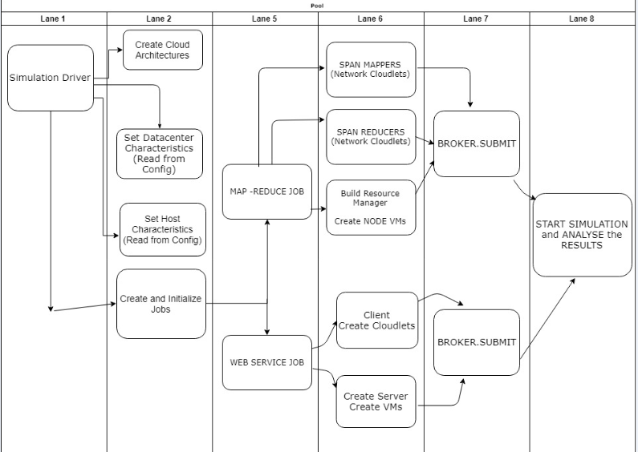
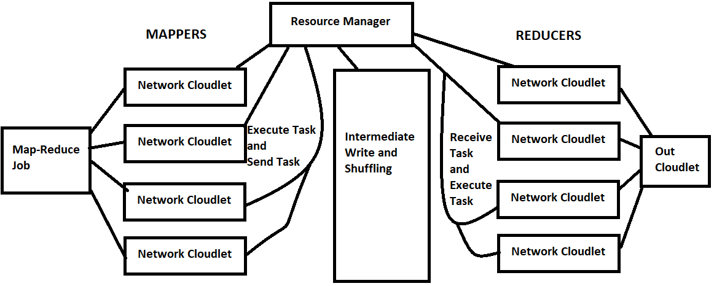
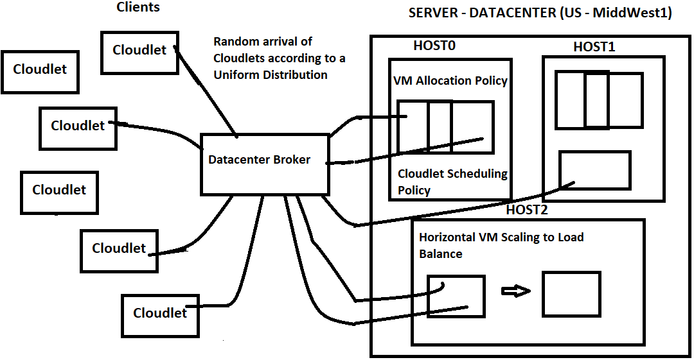

## CS 441 - Engineering Distributed Objects for Cloud Computing
## Course Project - Cloud Simulation using Cloudsim-Plus

---

### Overview

This project is part of the course curriculum of the CS441 - Cloud Computing objects at the University of Illinois at Chicago.

Cloud computing is the leading technology for delivery of reliable, secure, fault-tolerant, sustainable, and scalable computational services. For assurance of such characteristics in cloud systems under development, it is required timely, repeatable, and controllable methodologies for evaluation of new cloud applications and policies, before actual development of cloud products.

In this project we aim to analyze and build various cloud architectures with multiple datacenters (according to availability region) , the network they use to connect with each other, each of the datacenter having multiple hosts, host network topology, build and allocation of VMs to this hosts, Cloudlet scheduling policies, Dynamic load balancing algorithm and finally the costs associated with execution of two main types of jobs (map reduce and webservice) on this cloud infrastructure. 

### Team members (in alphabetical order)

- Manoj Prabhakar Nallabothula (mnalla2@uic.edu)
- Mayank K Rastogi (mrasto3@uic.edu)
- Mohammed Siddiq (msiddi56@uic.edu)
- Saikrishna Vanamala (svanam2@uic.edu)

### Instructions

#### Docker Image

The docker image for running this project can be dound at [DockerHub](link/to/docker/image)

#### Prerequisites

- [SBT](https://www.scala-sbt.org/) installed on your system

#### Running the project using sbt

1. Clone or download this repository onto your system
2. Open the Command Prompt (if using Windows) or the Terminal (if using Linux/Mac) and browse to the project directory
3. Build the project and generate the jar file using SBT
   
    ```
    sbt clean compile run
    ```

### Architecture of the cloud simulation

### Components of the application

#### Control Flow

1. Driver Program:

   The main entry point to the simulation application is the Driver Program. Each Type of Job (Map-Reduce, Web-Service) is initialized in the Driver Program, each job is associated with a datacenter broker which will handle the execution of this job till start to finish.

   The simulation object reference, broker reference, job reference, datacenter reference, hosts reference is all originated from this Driver Program.

2. Job:

   A Job simulates the type of application which needs to get executed on the cloud infrastructure. Two main types of jobs are designed - Map/Reduce and Web-Service. Each Job is associated with a Datacenter Broker who specializes in execution of a particular job.

   


#### Jobs Architecture:


##### Map-Reduce




We Split the Job into three different tasks: Mapper, Reducer and ResourceManager.

1. Mappers: Defines an individual mapper which will work on a particular file split and executes the map task [CloudletExecutionTask]. After done with execution it will emit/write the map result simulated using the [CloudletSendTask].

2. Reducers: Defines an individual reducer task which will take the output written by the mapper from the intermediate storage, processes it and writes/persists to the output node.

3. Resource Manager: Models a resource manager, which takes in the Job requests allocated/schedules the jobs among the different available nodes as specified by the job conf.

4. Worker Nodes and VMs: Each of the above cloudlets are executed on these worker nodes which are nothing but the VMs allocated to the job by the resource manager.


##### Web Service



A Webservice job simulates the execution of Dynamic User requests in the form of dynamic arrival of cloudlets using a Uniform Distribution prediction. These dynamic User requests are submitted to Data Center Broker, who decides the allocation of these cloudlets on to the VM using the custom min-min and max-min scheduling and load balancing policy.

The execution of these jobs for different cloud architectures has been compared and the results been analyzed to choose an optimum architecture with a greater return on investments.     


#### Load Balancing Algorithms

##### Min-Min

Min-Min start with the set of all unassigned tasks in the make-span. This algorithm work in two phases. First, the minimum expected completion time for all the tasks is calculated. The completion time for all the tasks is calculated on all the machines. In the second phase, the task with the minimum expected completion time from make-span is selected and that tasks assigned to the corresponding resource. Then the task which is completed that is removed from the make-span and this process is repeated until all tasks are completed.

A data center broker that uses Min-min load balancing algorithm to place Cloudlets on the available VMs. The algorithm prioritizes smaller cloudlets (ones with smaller estimated execution time) over larger cloudlets and assigns them to VMs first.

##### Max-Min

Max-Min start with the set of all unassigned tasks in the make-span. This algorithm also works in two phases. First, the maximum expected completion time for all the tasks is calculated. The completion time for all the tasks is calculated on all the machines. In the second phase, the task with the maximum expected completion time from make-span is selected and that tasks assigned to the corresponding resource. Then the task which is completed that is removed from the make-span and this process is repeated until all tasks are completed.

A data center broker that uses Max-min load balancing algorithm to place Cloudlets on the available VMs. The algorithm prioritizes smaller cloudlets (ones with smaller estimated execution time) over larger cloudlets and assigns them to VMs first.


#### VM Allocation Policies

These policies define the allocation of VMs to the Host.

##### Random Allocation

A Random allocation policy defines the random allocation of Vms to its Hosts. The Host list is shuffled and a random Host is picked. This picked Host is first prioritized for allocation of VMs. Once VMs are allocated to this Host and the Host is at maximum utilization, another Host is picked according to the defined Random policy to get it allocated to the future VMs   

##### Nearest Host Allocation

A more sophisticated allocation policy than the Random allocation. The nearest host allocation policy will first allocate the VMs in the Same Host till the maximum utilization, once its utilization capacity is reached, it will try to allocate the VM in the same Rack through scanning the EDGE SWITCH for any under-utilized Host. If it doesn't find any Host in the Edge Switches, it will start scanning the AGGREGATE SWITCH to identify any underutilized Host. Finally, if it is not able to find the Host through the Aggregate Switches also, Then it will try to look into another datacenters with the help of ROOT SWITCH Scan and Datacenter Broker dynamic table list.   

### Simulation Results and Analysis:

